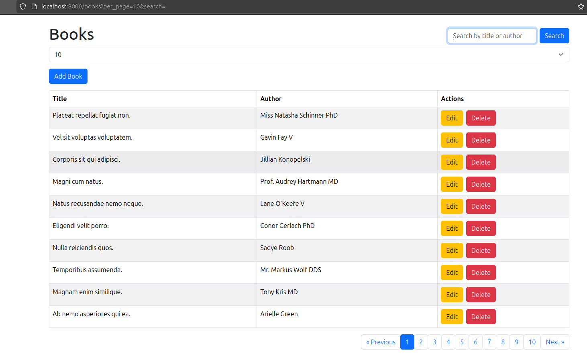

## How To

````
composer create-project laravel/laravel laravel-books
cd laravel-books

````

````
composer require inertiajs/inertia-laravel
npm install @inertiajs/inertia @inertiajs/inertia-react react react-dom

````

````
npm install react-bootstrap bootstrap

````

````
composer require fzaninotto/faker

````

````
php artisan migrate:fresh --seed

````
